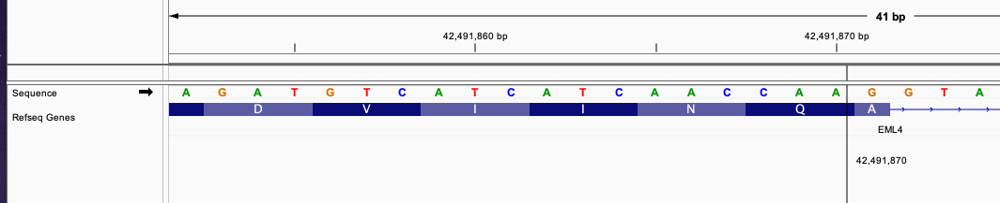
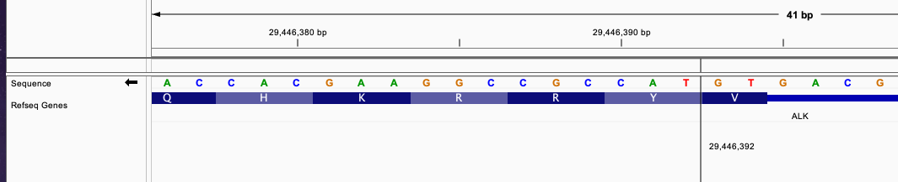
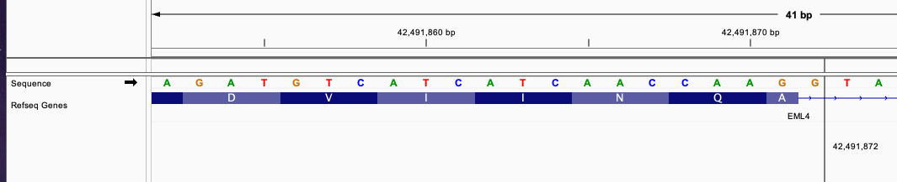
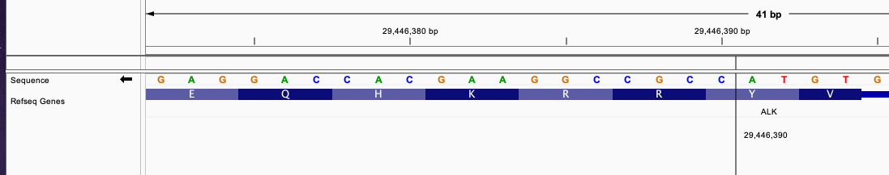
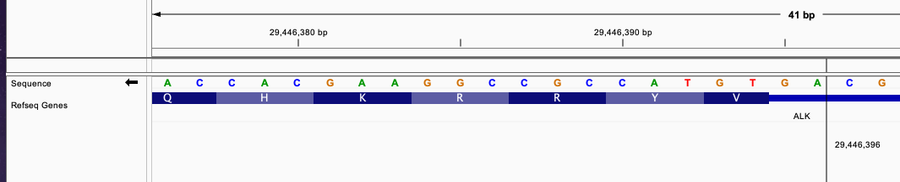

## Overview

Gene fusions often result from large genomic rearrangements such as structural variants. While WGS secondary analysis pipelines typically contain alignment and variant calling stages, very few of them contain dedicated gene fusion callers. When they are included, they are usually associated with RNA-Seq pipelines where gene fusions can be readily observed.

Since gene fusions are frequently observed in cancer and since many sequencing experiments do not include paired RNA-Seq data, we have added gene fusion detection and annotation to Illumina Connected Annotations.

The rich diversity in gene fusion architectures and their likely mechanisms can be seen below:


:::info Publication
Kumar-Sinha, C., Kalyana-Sundaram, S. & Chinnaiyan, A.M. [Landscape of gene fusions in epithelial cancers: seq and ye shall find](https://genomemedicine.biomedcentral.com/articles/10.1186/s13073-015-0252-1). Genome Med 7, 129 (2015)
:::

## Approach

Illumina Connected Annotations uses structural variant calls to evaluate if they form either putative intra-chromosomal or inter-chromosomal gene fusions. Let's consider two transcripts, `NM_014206.3` (**TMEM258**) and `NM_013402.4` (**FADS1**). Both of these genes are on the reverse strand in the genome. The vertical bar indicates the breakpoint where these transcripts are fused:


The above explains where the transcripts are fused together, but it doesn't explain in which orientation. By using the directionality encoded in the translocation breakend, we can rearrange these two transcripts in four ways:


Only two of the combinations yields a fusion containing both the transcription start site (TSS) and the stop codon. In one case, we can even detect an in-frame gene fusion.
If only unidirectional gene fusions are desired, only these two fusions can be detected. If `enable-bidirectional-fusions` is enabled, all four cases can be identified.

:::info Interpreting translocation breakends

At first glance, translocation breakends are a bit daunting. However, once you understand how they work, they're actually quite simple. For more information, we recommend reading section 5.4 in the [VCF 4.2 specification](https://samtools.github.io/hts-specs/VCFv4.2.pdf).

| REF | ALT  | Meaning                                                    |
|:----|:-----|:-----------------------------------------------------------|
| s   | t[p[ | piece extending to the right of p is joined after t        |
| s   | t]p] | reverse comp piece extending left of p is joined after t   |
| s   | ]p]t | piece extending to the left of p is joined before t        |
| s   | [p[t | reverse comp piece extending right of p is joined before t |
:::

### Variant Types

Specifically we can identify gene fusions from the following structural variant types:
* deletions (`<DEL>`)
* tandem_duplications (`<DUP:TANDEM>`)
* inversions (`<INV>`)
* translocation breakpoints (`AAAAAAAAAAAAAAAAAATTAGTCAGGCAC[chr3:153444911[`) 

### Criteria

The following criteria must be met for Illumina Connected Annotations to identify a gene fusion:
1. After accounting for gene orientation and genomic rearrangements, both transcripts must have the same orientation if `enable-bidirectional-fusions` is not enabled. They can have the same or different orientations if `enable-bidirectional-fusions` is set.
1. Both transcripts must be from the same transcript source (i.e. we won't mix and match between RefSeq and Ensembl transcripts)
1. Both transcripts must belong to different genes
1. Both transcripts cannot have a coding region that already overlaps without the variant (i.e. in cases where two genes naturally overlap, we don't want to call a gene fusion)

### Gene fusion in-frame detection
Illumina Connected Annotations will produce a boolean value field `inFrame` if the fusion is calculated to be in a position that can continue the transcript from one end to other end without frameshift.
To be an `inFrame` gene fusion, the fusion breakend has to be in a position where reading frame from the start codon of one transcript end is continued with the reading frame from the other transcript up to the stop codon.
If this happened, we predict the gene fusion can produced a fused transcript without frameshift.

We have several cases for a gene fusion to be detected as `inFrame` based on the breakend position.

- Exon - Exon gene fusion

This gene fusion happens when the breakend for both the first transcript and the second transcript fall in the exon region and the breakend complete the codon triplet.
Consider this VCF entry:

```scss
#CHROM	POS	ID	REF	ALT	QUAL	FILTER
chr2	42491870	.	A	A]chr2:29446392]	.	PASS
```
This defines a fusion of forward strand gene EML4 and reverse strand gene ALK. Position chr2 42491870 is in EML4 gene in the exon region and chr2 29446392 is in ALK exon region.





From the image, the fusion between those two transcript will produce a new exon that has continuous reading frame without frameshift.
The triplet in EML4 from position 42491868, 42491869, and 42491870 will be continued with triplet from ALK gene in position 29446390, 29446391, and 29446392.
This fusion will be predicted to produce a fused transcript since the start codon and stop codon is connected without frameshift.
The fused sequence around the breakend will be: `....AACCAA|TACCGC.....`.
This fusion will produce `inFrame: true` annotation.

- Exon - Intron gene fusion

This gene fusion happens when the breakend in one end is in exon position and the other end is in intron position.
Since the fusion is connecting exon and intron, we consider the intron to be transcribed as part of the new exon.
The fusion will be considered in frame if the merged intron in a number that complete the triplet between to fused exon.
Consider this VCF entry:

```scss
#CHROM	POS	ID	REF	ALT	QUAL	FILTER
chr2	42491870	.	A	A]chr2:29446395]	.	PASS
```

This define a similar fusion with the previous example between EML4 and ALK gene but in slightly different position.
Now, the breakend for ALK gene is in intron position. Despite that, the number of intron is 1 which complete the incomplete codon from the next exon.


Originally, the first 2 nucleotide in the exon after breakend in position 29446393 and 29446394 is an incomplete triplet that need 1 nucleotide from another exon to complete it.
With the fusion adding 1 nucleotide from the intron position, this will complete the triplet and continue the reading frame without frameshift.
The fused sequence around the breakend will be: `....AACCAA|GTGTAC.....`. The newly formed triplet is `GTG`.
This fusion will produce `inFrame: true` annotation.

- Intron - Exon gene fusion

This gene fusion is similar with the previous case but teh intron breakend is in teh first gene and the exon breakend is the the second gene.
Consifder this VCF entry:
```scss
#CHROM	POS	ID	REF	ALT	QUAL	FILTER
chr2	42491872	.	G	G]chr2:29446390]	.	PASS
```





This fusion define a similar fusion with the previous example between EML4 and ALK gene.
The breakend of EML4 gene is in intron and the breakend for ALK is in exon region.
The breakend connecting an incomplete codon triplet from EML4 gene exon in position 42491871, 1 nucleotide in EML4 intron position 42491872, and 1 nucleotide from ALK gene exon in position 29446390.
These 3 nucleotides will merge into a complete triplet that continue the transcription of the fused transcript without frameshift.
The fused sequence around the breakend will be: `....AACCAAGG|CCGC.....`. The newly formed triplet is `GGC`
This fusion will produce `inFrame: true` annotation.

- Intron - Intron gene fusion

This gene fusion case has breakend in intron for both end of transcript. In this case, we consider incomplete nucleotides from nearby exon and adding the additional nucleotides from joined intron to check wheteher it can continue the transcription without frameshift.
Consider this VCF entry:
```scss
#CHROM	POS	ID	REF	ALT	QUAL	FILTER
chr2	42491872	.	G	G]chr2:29446396]	.	PASS
```




The breakend for EML4 gene is in intron and nearby exon has 1 nucleotides from incomplete codon. The breakend for ALK gene is in intron with 2 nucleotides before the nearby exon. Nearby exon has 2 nucleotides from incomplete codon.
Joining all of these nucleotides, we will have 6 nucleotides that can form 2 codon triplets and continuing the transcript without frameshift.
The fused sequence around the breakend will be: `....AACCAAGG|AGTGTAC.....`. The newly formed triplets are `GGA` and `GTG`.


## ETV6/RUNX1 Example

ETV6/RUNX1 is the most common gene fusion in childhood B-cell precursor acute lymphoblastic leukemia (ALL). Samples with this translocation are associated with a good prognosis and excellent response to treatment.

:::info Publication
Sun C., Chang L., Zhu X. [Pathogenesis of ETV6/RUNX1-positive childhood acute lymphoblastic leukemia and mechanisms underlying its relapse](https://www.oncotarget.com/article/16367/text/). Oncotarget. 2017; 8: 35445-35459
:::

### VCF

Here's a simplified representation of the translocation breakends called by the Manta structural variant caller:

```scss
##fileformat=VCFv4.1
#CHROM  POS     ID      REF     ALT     QUAL    FILTER  INFO
chr12	12026270	.	C	[chr21:36420865[C	.	PASS	SVTYPE=BND
chr12	12026305	.	A	A]chr21:36420571]	.	PASS	SVTYPE=BND
chr21	36420571	.	C	C]chr12:12026305]	.	PASS	SVTYPE=BND
chr21	36420865	.	C	[chr12:12026270[C	.	PASS	SVTYPE=BND
```

When you put these calls together, the resulting genomic rearrangement looks something like this:


### JSON Output

The annotation for the first variant in the VCF looks like this:

```json {36-58}
{"positions":[
{
  "chromosome": "12",
  "position": 12026270,
  "refAllele": "C",
  "altAlleles": [
    "[chr21:36420865[C"
  ],
  "filters": [
    "PASS"
  ],
  "cytogeneticBand": "12p13.2",
  "variants": [
    {
      "vid": "12-12026270-C-[chr21:36420865[C",
      "chromosome": "12",
      "begin": 12026270,
      "end": 12026270,
      "isStructuralVariant": true,
      "refAllele": "C",
      "altAllele": "[chr21:36420865[C",
      "variantType": "translocation",
      "transcripts": [
        {
          "transcript": "ENST00000396373.4",
          "source": "Ensembl",
          "bioType": "mRNA",
          "introns": "5/7",
          "geneId": "ENSG00000139083",
          "hgnc": "ETV6",
          "consequence": [
            "transcript_variant",
            "unidirectional_gene_fusion"
          ],
          "impact": "modifier",
          "geneFusions": [
            {
              "transcript": "ENST00000437180.1",
              "bioType": "mRNA",
              "source": "Ensembl",
              "geneId": "ENSG00000159216",
              "proteinId": "ENSP00000409227.1",
              "intron": 2,
              "hgnc": "RUNX1",
              "hgvsr": "ENST00000437180.1(RUNX1):r.?_58+274::ENST00000396373.4(ETV6):r.1009+3367_?",
              "directionality": "unidirectional"
            },
            {
              "transcript": "ENST00000300305.3",
              "bioType": "mRNA",
              "source": "Ensembl",
              "isCanonical": true,
              "geneId": "ENSG00000159216",
              "proteinId": "ENSP00000300305.3",
              "intron": 1,
              "hgnc": "RUNX1",
              "hgvsr": "ENST00000300305.3(RUNX1):r.?_58+274::ENST00000396373.4(ETV6):r.1009+3367_?",
              "directionality": "unidirectional"
            }
          ],
          "isCanonical": true,
          "proteinId": "ENSP00000379658.3"
        },
        {
          "transcript": "NM_001987.5",
          "source": "RefSeq",
          "bioType": "mRNA",
          "introns": "5/7",
          "geneId": "2120",
          "hgnc": "ETV6",
          "consequence": [
            "transcript_variant",
            "unidirectional_gene_fusion"
          ],
          "impact": "modifier",
          "geneFusions": [
            {
              "transcript": "NM_001754.5",
              "bioType": "mRNA",
              "source": "RefSeq",
              "isCanonical": true,
              "geneId": "861",
              "proteinId": "NP_001745.2",
              "intron": 2,
              "hgnc": "RUNX1",
              "hgvsr": "NM_001754.5(RUNX1):r.?_58+274::NM_001987.5(ETV6):r.1009+3367_?",
              "directionality": "unidirectional"
            }
          ],
          "isCanonical": true,
          "proteinId": "NP_001978.1"
        }
      ]
    }
  ]
}
]}

```

| Field            | Type   | Notes                                     |
|:-----------------|:------:|:------------------------------------------|
| transcript       | string | transcript ID                             |
| bioType          | string | descriptions of the [biotypes from Ensembl](https://uswest.ensembl.org/info/genome/genebuild/biotypes.html) |
| exon             | int    | exon that contained fusion breakpoint     |
| intron           | int    | intron that contained fusion breakpoint   |
| geneId           | string | gene ID. e.g. ENSG00000116062             |
| hgnc             | string | gene symbol. e.g. MSH6                    |
| hgvsr            | string | HGVS RNA nomenclature                     |

#### Gene Fusion Data Sources

To provide more context to our gene fusions, we provide the following gene fusion data sources:
* [COSMIC](../data-sources/cosmic)
* [FusionCatcher](../data-sources/fusioncatcher)

#### Consequences

When a gene fusion is identified, we add the following Sequence Ontology consequence:

```json {3}
              "consequence": [
                "transcript_variant",
                "gene_fusion"
              ],
```
* If both transcripts have the same orientation, we label it as `unidirectional_gene_fusion`, if they have different orientations, we label it as `bidirectional_gene_fusion`
* If both unidirectional and bidirectional ones are detected, we label it as `gene_fusion`.

#### Gene Fusions Section

The `geneFusions` section is contained within the object of the originating transcript. It will contain all the pairwise gene fusions that obey the criteria outline above. In the case of `ENST00000396373.4`, there 7 other Ensembl transcripts that would produce a gene fusion. For `NM_001987.4`, there was only one transcript (`NM_001754.4`) that produce a gene fusion.

For each originating transcript, we report the following for each partner transcript:
* transcript ID
* gene ID
* HGNC gene symbol
* transcript bio type (e.g. protein_coding)
* intron or exon number containing the breakpoint
* HGVS RNA notation
* gene fusion directionality

:::tip
Before Illumina Connected Annotations 3.15, we provided HGVS coding notation. However, HGVS r. notation is more appropriate for these types fusion splicing events (see [HGVS SVD-WG007](https://varnomen.hgvs.org/bg-material/consultation/svd-wg007)).
:::

```json {8}
          "geneFusions": [
            {
              "transcript": "NM_001754.4",
              "bioType": "protein_coding",
              "intron": 2,
              "geneId": "861",
              "hgnc": "RUNX1",
              "hgvsr": "NM_001754.4(RUNX1):r.?_58+274::NM_001987.4(ETV6):r.1009+3367_?",
              "directionality":"uniDirectional"
            }
          ],
```

The HGVS RNA notation above indicates that the gene fusion starts with `NM_001754.4` (RUNX1) until CDS position 58 and continues with `NM_001987.4` (ETV6). `1009+3367` indicates that the fusion occurred 3367 bp within intron 2.

