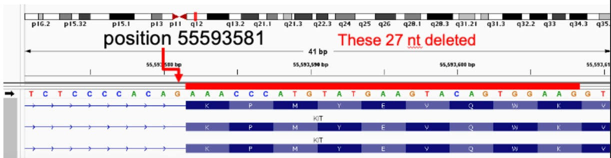

## Background
When a variant can be moved (due to alignment) acorss junctions (e.g. start, stop or splice site), the annotation may vary depending on which exact alignement was used. For example, a left-aligned deletion that effects the splice acceptor site, upon right-alignment, may become an exon variant. 

Note that: 
* When right-aligned the variant starts at the first base of the exon (as pictured).
* When left-aligned the variant can be shifted two base pairs and starts at a splice acceptor site.

From the point of view of the translation mechinary, the important question is whether the sequence that identifies a junction is preserved, regardless of the variant position. In the case of the deletion above, we believe that the variant is more accurately characterized as an `inframe_deletion` not a `splice_acceptor_variant` as splice acceptor sequence `AG` is uneffected.

When faced with such variants, we will assign junction disrupting consequnces only if the variant cannot be shifted out of the junction.

## Implementation
By default and convention, the left-aligned variant is annotated. If the variant overlaps a junction (as judged by consequences), it is right-aligned and annotated. If both alignment produces junction disruption, the left-aligned annotation is reported. If however, only one of the alignment causes junction disruption but not the other, the non-junction-disrupting annotation is reported.

:::note
This only effects transcript annotations. Supplementary annotations are reported on the left-aligned variant and HGVS notations are calculated on right-aligned variant.
:::
