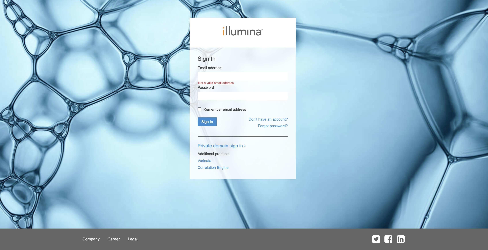
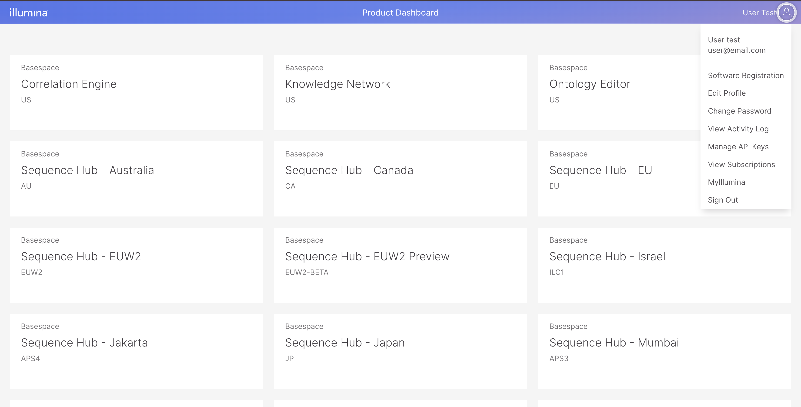
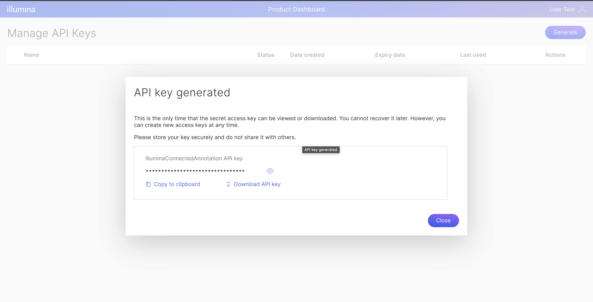

Illumina Connected Annotations is written in C# using [.NET Core](https://www.microsoft.com/net/download/core) (an amazing runtime environment that currently runs on Windows, Linux, Mac OS X, and in Docker images). Once .NET Core has been downloaded, all you need to do is grab the source, compile it, and grab the data files.

:::tip
Illumina Connected Annotations currently uses .NET6.0. Please make sure that you have the most current runtime from the [.NET Core downloads](https://www.microsoft.com/net/download/core) page.
:::

## Getting Illumina Connected Annotations

### Latest Release
Please visit [Illumina Connected Annotations](https://developer.illumina.com/illumina-connected-annotations). to obtain the latest release.

```bash
mkdir -p IlluminaConnectedAnnotations/Data
cd IlluminaConnectedAnnotations
unzip IlluminaConnectedAnnotations-3.24.0-0-gc13dcb61-net6.0.zip
```

### Quick Start
If you want to get started right away, we've created [a script](TestIlluminaConnectedAnnotations.sh) that unzips the Illumina Connected Annotations build, downloads the annotation data, and starts annotating a test file:

```bash
bash ./TestIlluminaConnectedAnnotations.sh IlluminaConnectedAnnotationsBuild.zip
```
We have verified that this script works on Windows (using Git Bash or WSL), Linux, and Mac OS X.

Before you run the script, please make sure [Prerequisite](#prerequisite) is configured correctly.

### Docker

Obtain the docker image in a zip file (e.g. IlluminaConnectedAnnotations-3.24.0-0-gc13dcb61-net6.0-docker.tar.gz), and load it as follows

```bash
docker load < IlluminaConnectedAnnotations-3.24.0-0-gc13dcb61-net6.0-docker.tar.gz
```

If you want to build your own docker image, it is really easy to do. You just need to have Illumina Connected Annotations zip file and then download the [Dockerfile](https://illumina.github.io/IlluminaConnectedAnnotationsDocumentation/files/Dockerfile) and [this script](https://illumina.github.io/IlluminaConnectedAnnotationsDocumentation/files/create_docker_image.sh).

Put both files (`create_docker_image.sh` and `Dockerfile`) inside the same folder.

In terminal, execute command below inside the folder where you put those scripts:

```bash
chmod +x create_docker_image.sh
./create_docker_image.sh [path to zip file] [image tag]
```

After you run the script, the docker image will be available in your local machine with image name `illumina-connected-annotations:[image tag specified]`.

For Docker, we have special instructions for running the DataManager:

```bash
docker run --rm -it -v local/data/folder:/scratch illumina-connected-annotations:v3.24.0 DataManager --ga GRCh37 -o /scratch
```

Similarly, we have special instructions for running IlluminaConnectedAnnotations (Here's [a toy VCF](https://illumina.github.io/IlluminaConnectedAnnotationsDocumentation/files/HiSeq.10000.vcf.gz) in case you need it):

```bash
docker run --rm -it -v local/data/folder:/scratch illumina-connected-annotations:v3.24.0 Annotator -c /scratch/Cache/ \
     -r /scratch/References/Homo_sapiens.GRCh37.Nirvana.dat \
     --sd /scratch/SupplementaryAnnotation/GRCh37 \
     -i /scratch/HiSeq.10000.vcf.gz -o /scratch/HiSeq
```
:::caution
Please note that since our data files are usually accessed through a Docker volume, there is a noticeable performance penalty when running Illumina Connected Annotations in Docker.
:::
:::tip
For convenience, the user is encouraged to create aliases for the docker commands. For example:
```bash
alias IlluminaConnectedAnnotations="docker run --rm -it -v local/data/folder:/scratch illumina-connected-annotations:v3.24.0 IlluminaConnectedAnnotations"
```
:::

## Downloading the data files

To download the latest data sources (or update the ones that you already have), use the following command to automate the download from S3:

```bash
dotnet DataManager.dll make-config -r GRCh37

dotnet DataManager.dll download \
-r GRCh37 \
--dir Data 
```

Check [Data Manager](../utilities/data-manager.mdx) for more details on controlling data sources and their versions.

:::info Glitches in the Matrix
Every once in a while, the download process does not go smoothly. Perhaps the internet connection cut out or you ran out of disk space. The DataManager attempts to detect these 
situations by checking the file sizes at the very end. If you see that a file was marked `truncated`, try fixing the root cause and running the downloader again.
:::

:::tip
From time to time, you can re-run the DataManager to get the latest annotation files. It will only download the files that changed.
:::

## Download a test VCF file

Here's [a toy VCF file](https://illumina.github.io/IlluminaConnectedAnnotationsDocumentation/files/HiSeq.10000.vcf.gz) you can play around with:

```bash
curl -O https://illumina.github.io/IlluminaConnectedAnnotationsDocumentation/files/HiSeq.10000.vcf.gz
```

## Prerequisite

### Creating Illumina API key
To use Data Manager, users have to create an Illumina API key. To generate the API key, users are required to create Illumina public account which can be created freely from [this page](https://accounts.login.illumina.com).



Click "Don't have an account" link to go to the user creation form. If you already have an account, enter your credentials.
Once you login, you will go to Product Dashboard page. Click on the user icon on the top right to open menu and choose Manage API Keys.



In the Manage API Keys, click Generate Button and enter the API key name. Once you have done that, the generated API key will be displayed.



### Storing Illumina API key in your system
Copy the API key and store it into a file with json format like below:

```json
{
  "MyIlluminaApiKey": "<your Illumina account api key>"
}
```

By default, Data Manager will look for file `~/.ilmnAnnotations/credentials.json` but this file may be saved at any location and passed in as commandline argument.
```json
{
  "MyIlluminaApiKey": "<your Illumina account api key>"
}
```

If you have API key and API secret for Illumina Connected Annotation professional tier data source, you should put those credentials in this file also. See [Licensed Content](./licensedContent.mdx) for details.
```json
{
  "MyIlluminaApiKey": "<your Illumina account api key>",
  "ApiKey": "<your professional data source API key>",
  "ApiSecret": "<your professional data source API secret>"
}
```

## Running Illumina Connected Annotations

Once you have downloaded the data sets, use the following command to annotate your VCF:

```bash
dotnet Annotator.dll \
     -c Data/Cache \
     --sd Data/SupplementaryAnnotation/GRCh37 \
     -r Data/References/Homo_sapiens.GRCh37.Nirvana.dat \
     -i HiSeq.10000.vcf.gz \
     -o HiSeq.10000
```

* the `-c` argument specifies the cache directory
* the `--sd` argument specifies the supplementary annotation directory
* the `-r` argument specifies the compressed reference path
* the `-i` argument specifies the input VCF path
* the `-o` argument specifies the output filename prefix

When running Illumina Connected Annotations, performance metrics are shown as it evaluates each chromosome in the input VCF file:

```bash
---------------------------------------------------------------------------
Illumina Connected Annotations                      (c) 2024 Illumina, Inc.
                                                                     3.24.0
---------------------------------------------------------------------------

Initialization                                         Time     Positions/s
---------------------------------------------------------------------------
Cache                                               00:00:00.0
SA Position Scan                                    00:00:00.0      153,634

Reference                                Preload    Annotation   Variants/s
---------------------------------------------------------------------------
chr1                                    00:00:00.2  00:00:00.8       11,873

Summary                                                Time         Percent
---------------------------------------------------------------------------
Initialization                                      00:00:00.0        1.5 %
Preload                                             00:00:00.2        4.9 %
Annotation                                          00:00:00.8       18.5 %

Time: 00:00:04.4
```

The output will be a JSON file called `HiSeq.10000.json.gz`. Here's [the full JSON file](https://illumina.github.io/IlluminaConnectedAnnotationsDocumentation/files/HiSeq.10000.json.gz).

## The Illumina Connected Annotations command line
The full command line options can be viewed by using the `-h` option or no options
```bash
dotnet Annotator.dll
---------------------------------------------------------------------------
Illumina Connected Annotations                      (c) 2024 Illumina, Inc.
                                                                     3.24.0
---------------------------------------------------------------------------

USAGE: dotnet Annotator.dll -i <vcf path> -c <cache dir> --sd <sa dir> -r <ref path> -o <base output filename>
Annotates a set of variants

OPTIONS:
      --cache, -c <directory>
                             input cache directory
      --in, -i <path>        input VCF path
      --tsv <path>           input VCF path
      --out, -o <file path>  output file path
      --ref, -r <path>       input compressed reference sequence path
      --sd <directory>       input supplementary annotation directory
      --sources, -s <VALUE>  annotation data sources to be used (comma
                               separated list of supported tags)
      --credentials-file, -l <VALUE>
                             File path to user credentials, default is set to ~
                               /.ilmnAnnotations/credentials.json
      --versions-config <assembly>
                             Annotation version config file. By default, it
                               will use file ~/.ilmnAnnotation/assembly_
                               annotation_config.json
      --ignore-license-error ignore error due to invalid license and skip
                               related data sources
      --force-mt             forces to annotate mitochondrial variants
      --legacy-vids          enables support for legacy VIDs
      --enable-dq            report DQ from VCF samples field
      --enable-bidirectional-fusions
                             enables support for bidirectional gene fusions
      --disable-junction-preservation
                             disable junction preserving functional annotation
      --str <VALUE>          user provided STR annotation TSV file
      --vcf-info <VALUE>     additional vcf info field keys (comma separated)
                               desired in the output
      --vcf-sample-info <VALUE>
                             additional vcf format field keys (comma separated)
                                desired in the output
      --sa-cutoff <VALUE>    Any SV larger than or equal to this value will
                               not have any supplementary annotations
      --simple-nomenclature-cutoff-length <VALUE>
                             Any SV larger than or equal to this value will
                               not have any simple nomenclature annotation.
                             Default is 1000.
      --output-format <VALUE>
                             output file format, available options: json, vcf.
      --help, -h             displays the help menu
      --version, -v          displays the version

##### Supported Annotation Sources #####
Basic Tier: DECIPHER, GME, GERP, DANN, REVEL, ClinGen, gnomAD, phyloP, TOPMed, DGV, 1000 Genomes, CliinVar, dbSNP, FusionCatcher, MITOMAP, MultiZ100Way

Professional Tier: PrimateAI(GRCh37), PrimateAI-3D(GRCh38), SpliceAI, COSMIC, OMIM.

##### Contact #####
Professional content licensing, feedback and technical support: annotation_support@illumina.com.
```

### Specifying annotation sources
By default, Illumina Connected Annotations will use all available data sources. However, the user can customize the set of sources with their versions using the `--versions-config` 
option. 

An Example of versions config json file below:
```json
{
    "Ensembl":
    {
        "GeneModels": "110"
    },
    "GenomeAssembly":
    {
        "GenomeAssembly": "GRCh37.p13"
    },
    "HGNC":
    {
        "GeneModels": "20240603"
    },
    "RefSeq":
    {
        "GeneModels": "105.20220307"
    },
    "clinvar":
    {
        "SmallVariant": "99999999"
    },
    "gnomad":
    {
        "LowComplexityRegions": "2.1",
        "SmallVariant": "2.1"
    }
}
```

If an unknown source is specified, a warning message will be printed.

```bash
dotnet Annotator.dll \
     -c Data/Cache/GRCh37 \
     --sd Data/SupplementaryAnnotation/GRCh37 \
     -r Data/References/Homo_sapiens.GRCh37.Nirvana.dat \
     -i HiSeq.10000.vcf.gz \
     -o HiSeq.10000 \
	 --versions-config /Users/bob/.ilmnAnnotations/customised_GRCh37_annotation_config.json
 ---------------------------------------------------------------------------
 Illumina Connected Annotations                      (c) 2024 Illumina, Inc.
                                                                     3.24.0
 ---------------------------------------------------------------------------
 
 Some requested data sources are not loaded.
 Data Source              Type                     Status    Comments                                                              
 ---------------------------------------------------------------------------
 GenomeAssembly           GenomeAssembly           Loaded    GRCh37.p13                                                            
 RefSeq                   GeneModels               Loaded    105.20220307                                           
 Ensembl                  GeneModels               Loaded    110                                                                   
 HGNC                     GeneModels               Loaded    20240603                                                              
 gnomad                   SmallVariant             Loaded    2.1 
 gnomad                   LowComplexityRegions     Loaded    2.1                                                                    
 clinvar                  SmallVariant             Skipped   Version 99999999 not available 

 Initialization                                         Time     Positions/s
 ---------------------------------------------------------------------------
 SA Position Scan                                    00:00:00.3      307,966
 ....
 ..
```
The list of available values is compiled from the files provided (using `-c` and `--sd` options).
