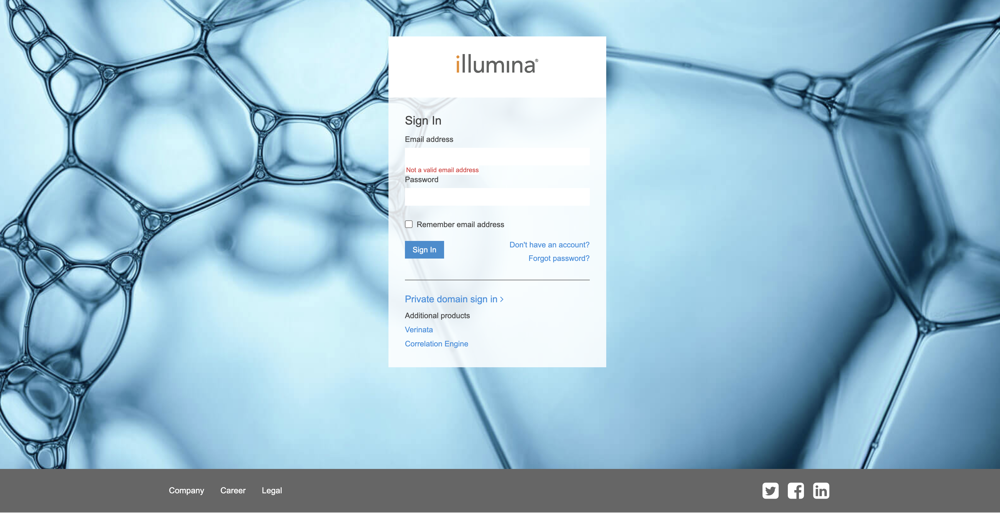

### Creating Illumina API key
To use Illumina Connected Annotation and its utilities, users have to create an Illumina API key. To generate the API key, users are required to create Illumina public account which can be created freely from [this page](https://accounts.login.illumina.com).



Click "Don't have an account" link to go to the user creation form. If you already have an account, enter your credentials.
Once you login, you will go to Product Dashboard page. Click on the user icon on the top right to open menu and choose Manage API Keys.


In the Manage API Keys, click Generate Button and enter the API key name. Once you have done that, the generated API key will be displayed.


### Storing Illumina API key in your system
Copy the API key and store it into a file with json format like below:

```json
{
  "MyIlluminaApiKey": "<your Illumina account api key>"
}
```

By default, Data Manager will look for file `~/.ilmnAnnotations/credentials.json` but this file may be saved at any location and passed in as commandline argument.
```json
{
  "MyIlluminaApiKey": "<your Illumina account api key>"
}
```

If you have API key and API secret for Illumina Connected Annotation professional tier data source, you should put those credentials in this file also.

Note that bring your own license (BYOL) should insert the user name and password as API key and API secret respectively.
```json
{
  "MyIlluminaApiKey": "<your Illumina account api key>",
  "ApiKey": "<your professional data source API key>",
  "ApiSecret": "<your professional data source API secret>"
}
```

If you have Dragen server, you can use the Dragen serial number to get premium access.
```json
{
  "MyIlluminaApiKey": "<your Illumina account api key>",
  "DragenSerialNo": "<your Dragen server serial no.>"
}
```
