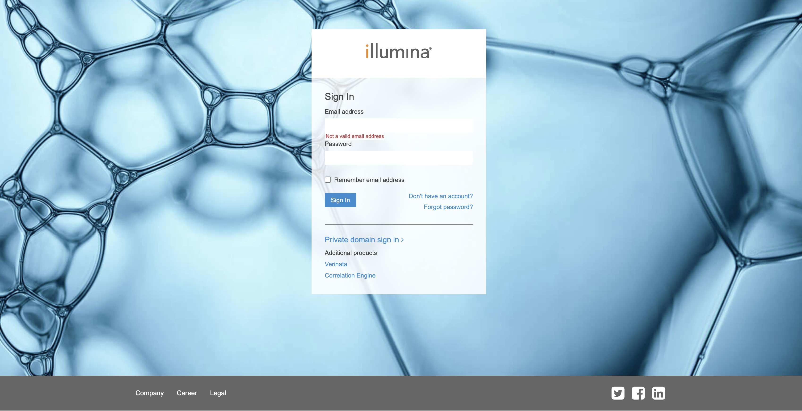
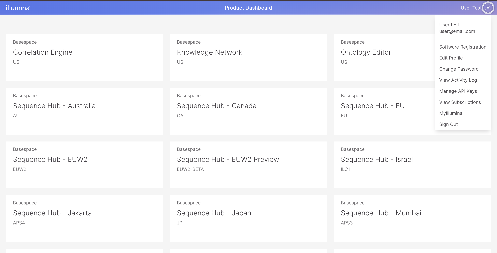
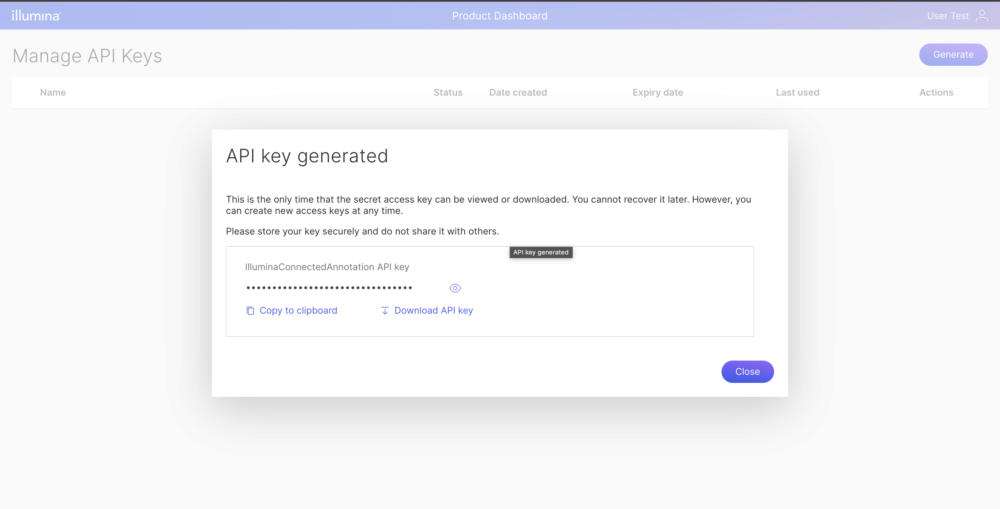

## Overview

Download Manager is a utility software from Illumina Connected Annotation software suite for user to easily pick and choose annotation database provided by Illumina.
Previously, we provided Downloader software that the user can run to download the latest annotation database automatically. With the new Download Manager, user can actually choose which database and which version to download.

## Prerequisite

### Creating Illumina API key
To use Download Manager, users have to create an Illumina API key. To generate the API key, users are required to create Illumina public account which can be created freely from [this page](https://accounts.login.illumina.com).



Click "Don't have an account" link to go to the user creation form. If you already have an account, enter your credentials.
Once you login, you will go to Product Dashboard page. Click on the user icon on the top right to open menu and choose Manage API Keys.



In the Manage API Keys, click Generate Button and enter the API key name. Once you have done that, the generated API key will be displayed.



Copy the API key and store it into a file with json format like below:

```json
{
  "IlmnApiKey": "<your api key>"
}
```

By default, Download Manager utility will look for file `~/.ilmnAnnotations/credentials.json` but you can also save the API key in different path and provide it as command line parameter later.

If you have API key and API secret for Illumina Connected Annotation professional tier data source, you should put those credentials in this file also.
Below is the format if you have professional data source API key and API secret:
```json
{
  "IlmnApiKey": "<your Illumina account api key>",
  "ApiKey": "<your professional data source API key>",
  "ApiSecret": "<your professional data source API secret>"
}
```

## Commands

There are several commands in Download Manager utility.

### List

The first command is `list`. This command is to list all available data annotation and version.

```bash
dotnet DownloadManager.dll list

---------------------------------------------------------------------------
DownloadManager                                     (c) 2024 Illumina, Inc.
                                                                     3.24.0
---------------------------------------------------------------------------

USAGE: dotnet DownloadManager.dll list [options]
List available data

OPTIONS:
      --credential, -l <VALUE>
                             Path to credential file. The default file
                               location is ~/.ilmnAnnotations/credentials.json
      --ref, -r <VALUE>      Assembly reference (GRCh38/GRCh37)
      --dir, -d <VALUE>      Local directory
      --sources, -s <VALUE>  data source to show
      --help, -h             displays the help menu
      --version, -v          displays the version

##### Supported Annotation Sources #####
Basic Tier: DECIPHER, GME, GERP, DANN, REVEL, ClinGen, gnomAD, phyloP, TOPMed, DGV, 1000 Genomes, CliinVar, dbSNP, FusionCatcher, MITOMAP, MultiZ100Way

Professional Tier: PrimateAI(GRCh37), PrimateAI-3D(GRCh38), SpliceAI, COSMIC, OMIM.

##### Contact #####
Professional content licensing, feedback and technical support: annotation_support@illumina.com.
```

There are several parameters that you can pass.

- Param `--ref` or `-r` is a required parameter. This is to filter data based on genome assembly reference. The value is either GRCh37 or GRCh38
- Param `--dir` or `-d` is an optional parameter. This param is the path to your local data directory. If you provide this param, the list will mark file that you have already downloaded.
- Param `--credential` or `-l` is an optional parameter. This param is the path to your credential file.
-- Param `--sources` or `-s` is a filter based on data source. Without this param, the list will display all data source but only display the latest version available. If you filter using this param, you will see all available version.

Below are some esample of the output:

```bash
dotnet DownloadManager.dll list -r GRCh38 -d /path/to/folder

DownloadManager                                     (c) 2024 Illumina, Inc.
                                                                     3.24.0
---------------------------------------------------------------------------

======================================================================================================================================================
Data Source                    | Annotation Type                | Description                              | Version
======================================================================================================================================================
DANN                           | Score                          | DANN                                     | 20200205 (*)
------------------------------------------------------------------------------------------------------------------------------------------------------
DECIPHER                       | StructuralVariant              | DECIPHER                                 | 201509 (*)
------------------------------------------------------------------------------------------------------------------------------------------------------
Ensembl                        | GeneModels                     | Ensembl                                  | 110 (*)
------------------------------------------------------------------------------------------------------------------------------------------------------
FusionCatcher                  | GeneFusion                     | FusionCatcher                            | 1.33 (*)
------------------------------------------------------------------------------------------------------------------------------------------------------
GME                            | SmallVariant                   | GME                                      | 20160618 (*)
------------------------------------------------------------------------------------------------------------------------------------------------------
GenomeAssembly                 | GenomeAssembly                 | GenomeAssembly                           | GRCh38.p12 (*)
------------------------------------------------------------------------------------------------------------------------------------------------------
Gerp                           | Score                          | Gerp                                     | 20110522 (*)
------------------------------------------------------------------------------------------------------------------------------------------------------
HGNC                           | GeneModels                     | HGNC                                     | 20230824 (*)
------------------------------------------------------------------------------------------------------------------------------------------------------
MultiZ100Way                   | Protein                        | MultiZ100Way                             | 20171006 (*)
------------------------------------------------------------------------------------------------------------------------------------------------------
PrimateAI                      | SmallVariant                   | PrimateAI                                | 0.2 (*)
------------------------------------------------------------------------------------------------------------------------------------------------------
REVEL                          | SmallVariant                   | REVEL                                    | 20200205 (*)
------------------------------------------------------------------------------------------------------------------------------------------------------
RefSeq                         | GeneModels                     | RefSeq                                   | GCF_000001405.40-RS_2023_03 (*)
------------------------------------------------------------------------------------------------------------------------------------------------------
TOPMed                         | SmallVariant                   | TOPMed                                   | freeze_5 (*)
------------------------------------------------------------------------------------------------------------------------------------------------------
clingen                        | Gene                           | ClinGen disease validity curations       | 20240508 (*)
                               |                                | ClinGen Dosage Sensitivity Map           | 20240508 (*)
                               | StructuralVariant              | ClinGen Dosage Sensitivity Map           | 20240508 (*)
------------------------------------------------------------------------------------------------------------------------------------------------------
clingen (legacy)               | StructuralVariant              | ClinGen                                  | 20160414 (*)
------------------------------------------------------------------------------------------------------------------------------------------------------
clinvar                        | SmallVariant                   | ClinVar                                  | 20240502 (*)
                               | StructuralVariant              | ClinVar                                  | 20240502 (*)
------------------------------------------------------------------------------------------------------------------------------------------------------
clinvar-preview                | SmallVariant                   | ClinVarPreview                           | 20240502 (*)
                               | StructuralVariant              | ClinVarPreview                           | 20240502 (*)
------------------------------------------------------------------------------------------------------------------------------------------------------
cosmic                         | Gene                           | Cosmic Cancer Gene Census                | 99 (*)
                               | GeneFusion                     | COSMIC gene fusions                      | 99 (*)
                               | SmallVariant                   | COSMIC                                   | 99 (*)
------------------------------------------------------------------------------------------------------------------------------------------------------
dbSNP                          | SmallVariant                   | dbSNP                                    | 156 (*)
------------------------------------------------------------------------------------------------------------------------------------------------------
globalAllele                   | SmallVariant                   | dbSNP                                    | 151 (*)
------------------------------------------------------------------------------------------------------------------------------------------------------
gnomad                         | Gene                           | gnomAD_gene_scores                       | 4.0 (*)
                               | LowComplexityRegions           | gnomAD_LCR                               | 2.1 (*)
                               | SmallVariant                   | gnomAD                                   | 4.1 (*)
                               | StructuralVariant              | gnomAD_SV                                | 4.0 (*)
------------------------------------------------------------------------------------------------------------------------------------------------------
gnomad-exome                   | SmallVariant                   | gnomAD_exome                             | 4.1 (*)
------------------------------------------------------------------------------------------------------------------------------------------------------
mitomap                        | SmallVariant                   | MITOMAP                                  | 20200819 (*)
                               | StructuralVariant              | MITOMAP_SV                               | 20200819 (*)
------------------------------------------------------------------------------------------------------------------------------------------------------
omim                           | Gene                           | OMIM                                     | 20240508 (*)
------------------------------------------------------------------------------------------------------------------------------------------------------
oneKg                          | RefMinor                       | 1000 Genomes Project                     | Phase 3 v3plus (*)
                               | SmallVariant                   | 1000 Genomes Project                     | Phase 3 v3plus (*)
                               | StructuralVariant              | 1000 Genomes Project (SV)                | Phase 3 v5a (*)
------------------------------------------------------------------------------------------------------------------------------------------------------
phylopScore                    | ConservationScore              | phyloP                                   | hg38 (*)
                               | Score                          | PhyloPPrimate                            | 1.0 (*)
------------------------------------------------------------------------------------------------------------------------------------------------------
primateAI-3D                   | SmallVariant                   | PrimateAI-3D                             | 1.0 (*)
------------------------------------------------------------------------------------------------------------------------------------------------------
spliceAI                       | SmallVariant                   | SpliceAI                                 | 1.3 (*)
------------------------------------------------------------------------------------------------------------------------------------------------------
(*) : available in local directory
```

```bash
dotnet DownloadManager.dll list -r GRCh38 -d /path/to/folder -s clinvar

---------------------------------------------------------------------------
DownloadManager                                     (c) 2024 Illumina, Inc.
                                                                     3.24.0
---------------------------------------------------------------------------

======================================================================================================================================================
Data Source                    | Annotation Type                | Description                              | Version
======================================================================================================================================================
clinvar                        | SmallVariant                   | ClinVar                                  | 20240502 (*)
                               |                                | ClinVar                                  | 20231230
                               |                                | ClinVar                                  | 20231203
                               |                                | ClinVar                                  | 20231028
                               |                                | ClinVar                                  | 20230930
                               |                                | ClinVar                                  | 20230903
                               |                                | ClinVar                                  | 20230822
                               |                                | ClinVar                                  | 20230608
                               |                                | ClinVar                                  | 20230509
                               |                                | ClinVar                                  | 20230301
                               |                                | ClinVar                                  | 20230210
                               |                                | ClinVar                                  | 20220901
                               |                                | ClinVar                                  | 20220505
                               |                                | ClinVar                                  | 20211202
                               |                                | ClinVar                                  | 20210805
                               |                                | ClinVar                                  | 20210603
                               |                                | ClinVar                                  | 20210401
                               |                                | ClinVar                                  | 20200903
                               |                                | ClinVar                                  | 20200302
                               |                                | ClinVar                                  | 20200102
                               |                                | ClinVar                                  | 20191001
                               |                                | ClinVar                                  | 20190808
                               |                                | ClinVar                                  | 20190204
                               |                                | ClinVar                                  | 20180129
                               | StructuralVariant              | ClinVar                                  | 20240502 (*)
                               |                                | ClinVar                                  | 20231230
                               |                                | ClinVar                                  | 20231203
                               |                                | ClinVar                                  | 20231028
                               |                                | ClinVar                                  | 20230930
                               |                                | ClinVar                                  | 20230903
                               |                                | ClinVar                                  | 20230822
                               |                                | ClinVar                                  | 20230608
                               |                                | ClinVar                                  | 20230509
                               |                                | ClinVar                                  | 20230301
                               |                                | ClinVar                                  | 20230210
                               |                                | ClinVar                                  | 20220901
                               |                                | ClinVar                                  | 20220505
------------------------------------------------------------------------------------------------------------------------------------------------------
(*) : available in local directory

```

### Create config

The second command is `make-config`. This command will generate a config file that will be used to define which annotation data and which version to download.
The generated config file is basically a template which you can edit manually. It will contain latest version of all data source. In case you want to exclude some data source or require a different version, you can edit it manually.

```bash
dotnet DownloadManager.dll make-config
---------------------------------------------------------------------------
DownloadManager                                     (c) 2024 Illumina, Inc.
                                                                     3.24.0
---------------------------------------------------------------------------

USAGE: dotnet DownloadManager.dll make-config [options]
Create a downloader config file

OPTIONS:
      --credential, -l <VALUE>
                             Path to credential file. The default file
                               location is ~/.ilmnAnnotations/credentials.json
      --ref, -r <VALUE>      Assembly reference (GRCh38/GRCh37)
      --out, -o <assembly>   Output file name. Default value is ~/.
                               ilmnAnnotation/assembly_annotation_config.json.
      --help, -h             displays the help menu
      --version, -v          displays the version

##### Supported Annotation Sources #####
Basic Tier: DECIPHER, GME, GERP, DANN, REVEL, ClinGen, gnomAD, phyloP, TOPMed, DGV, 1000 Genomes, CliinVar, dbSNP, FusionCatcher, MITOMAP, MultiZ100Way

Professional Tier: PrimateAI(GRCh37), PrimateAI-3D(GRCh38), SpliceAI, COSMIC, OMIM.

##### Contact #####
Professional content licensing, feedback and technical support: annotation_support@illumina.com.
```

There are several parameters for `make-config` command.
- Param `--credential` or `-l` is an optional parameter. This param is the path to your credential file.
- Param `--ref` or `-r` is a required parameter. This is to filter data based on genome assembly reference. The value is either GRCh37 or GRCh38
- Param `--out` or `-o` is an optional parameter. This param is the path where the config file will be written to. If not specified, it will write to ~/.ilmnAnnotation/{assembly}_annotation_config.json.

Below is example of the generated config file.

```json
{
  "Ensembl": {
    "GeneModels": "110"
  },
  "RefSeq": {
    "GeneModels": "GCF_000001405.40-RS_2023_03"
  },
  "GenomeAssembly": {
    "GenomeAssembly": "GRCh38.p12"
  },
  "clinvar": {
    "SmallVariant": "20240502",
    "StructuralVariant": "20240502"
  },
  ...
}
```

### Download file
The third command available is `download`. This command will do the actual file download.
It will also do sync with the data that are already exist in the local directory. It will automatically detect if there are files that already downloaded.
It will also auto update if you have older version of the data by deleting the old version and downloading the new version.

```bash
dotnet DownloadManager.dll download
---------------------------------------------------------------------------
DownloadManager                                     (c) 2024 Illumina, Inc.
                                                                     3.24.0
---------------------------------------------------------------------------

USAGE: dotnet DownloadManager.dll download [options]
Download file

OPTIONS:
      --credential, -l <VALUE>
                             Path to credential file. The default file
                               location is ~/.ilmnAnnotations/credentials.json
      --ref, -r <VALUE>      Assembly reference (GRCh38/GRCh37)
      --config, -c <VALUE>   Download file config. By default, it will use
                               file ~/.ilmnAnnotation/GRChXX_annotation_config.
                               json
      --dir, -d <VALUE>      Download file directory
      --thread, -t <VALUE>   Number of concurrent download
      --help, -h             displays the help menu
      --version, -v          displays the version

##### Supported Annotation Sources #####
Basic Tier: DECIPHER, GME, GERP, DANN, REVEL, ClinGen, gnomAD, phyloP, TOPMed, DGV, 1000 Genomes, CliinVar, dbSNP, FusionCatcher, MITOMAP, MultiZ100Way

Professional Tier: PrimateAI(GRCh37), PrimateAI-3D(GRCh38), SpliceAI, COSMIC, OMIM.

##### Contact #####
Professional content licensing, feedback and technical support: annotation_support@illumina.com.
```

There are several parameters for the `download` command.
- Param `--credential` or `-l` is an optional parameter. This param is the path to your credential file.
- Param `--ref` or `-r` is a required parameter. This is to filter data based on genome assembly reference. The value is either GRCh37 or GRCh38
- Param `--config` or `-c` is an optional parameter. This is the file config that contains database and version that you want to download. If not specified, it will use ~/.ilmnAnnotation/GRChXX_annotation_config.
json
- Param `--dir` or `-d` is a required pqrameter. It specified the directory that will be used to store all downloaded files.
- Param `--thread` or `-t` is an optional parameter. It is the number of thread that will be used to download file simultaneously. By default, the value is 4.
