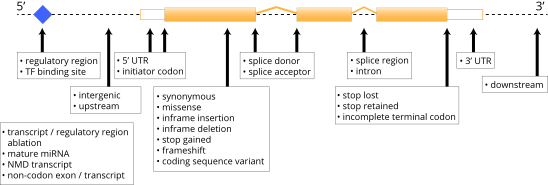

Illumina Connected Annotations provides translational research-grade annotation of genomic variants (SNVs, MNVs, insertions, deletions, indels, STRs, gene fusions, and SVs (including CNVs). It can be run as a stand-alone package, or integrated into larger software tools that require variant annotation.

The input to Illumina Connected Annotations are VCFs and the output is a structured JSON representation of all annotation and sample information (as extracted from the VCF). Illumina Connected Annotations handles multiple alternate alleles and multiple samples with ease.

The software is being developed under a rigorous SDLC and testing process to ensure accuracy of the results and enable embedding in other software. Illumina Connected Annotations uses a continuous integration pipeline where millions of variant annotations are monitored against baseline values daily.

## What does Illumina Connected Annotations annotate?

We use Sequence Ontology consequences to describe how each variant impacts a given transcript:

The transcript and gene models are obtained from [RefSeq](https://ftp.ncbi.nlm.nih.gov/genomes/all/annotation_releases/9606/) and [Ensembl](https://ftp.ensembl.org/pub/).
The current officially supported versions are:

| Data Source | Version                     | Release Date |
|-------------|-----------------------------|--------------|
| RefSeq      | GCF_000001405.40-RS_2023_03 | 2023-03-21   |
| Ensembl     | 110                         | 2023-04-27   |

In addition, it uses external data sources to provide additional context for each variant. 
Illumina Connected Annotations provides annotations from the following sources divided into 2 tiers: Professional and basic. 
The basic tier can be accessed free of charge. The professional tier requires a license. For access, please contact annotation_support@illumina.com. 

| Data Source          | Availability | Latest Supported Version |
|----------------------|--------------|--------------------------|
| Primate AI-3D        | Professional | 1.0                      |
| Splice AI            | Professional | 1.3                      |
| COSMIC               | Professional | 96                       |
| OMIM                 | Professional | 20231105                 |
| ClinVar              | Basic        | 20231028                 |
| 1000 Genomes Project | Basic        | Phase 3 v3plus           |
| DANN                 | Basic        | 20200205                 |
| dbSNP                | Basic        | 156                      |
| DECIPHER             | Basic        | 201509                   |
| GERP                 | Basic        | 20110522                 |
| GME Variome          | Basic        | 20160618                 |
| gnomAD               | Basic        | 3.1.2                    |
| MITOMAP              | Basic        | 20200819                 |
| REVEL                | Basic        | 20200205                 |
| TOPMed               | Basic        | freeze 5                 |
| Cancer Hotspots      | Basic        | 2017                     |
| FusionCatcher        | Basic        | 1.33                     |
| ClinGen              | Basic        | 20231105                 |
| MultiZ 100 way       | Basic        | 20171006                 |

## Download
Please visit [Illumina Connected Annotations](https://developer.illumina.com/illumina-connected-annotations).